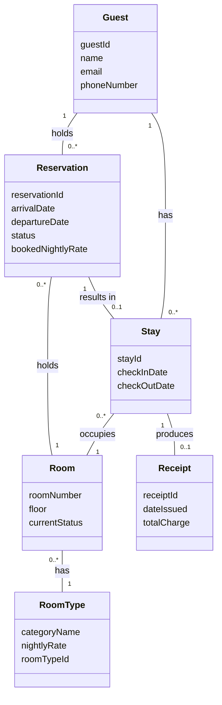
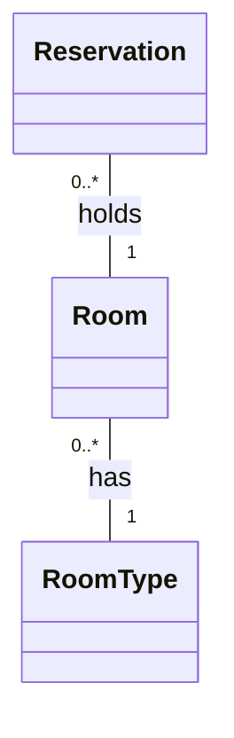

# Analysis by Kaashif Khan (Assignment 1) 

## Entity Inventory 

**Name: Reservation**
What it is: A reservation represents a booking that holds a room for specific dates for a guest planning to stay at Harborview Inn. 
What it knows: reservation ID, arrival date, departure date, status, booked nightly rate
Rationale: A reservation has it's own identity because each reservation is a distinct booking having information such as planned dates and status. 

**Name: Stay**
What it is: A stay represents the actual time that a guest stays in a room after checking in. 
What it knows: stay ID, check-in date, check-out date 
Rationale: A stay is different from a reservation and deserves it's own identity because the reservation represents the planned dates, while a stay represents the actual dates the guest stayed in the room. 

**Name: Guest**
What it is: A guest represents a customer who makes a reservation or stays at Harborview Inn. 
What it knows: guest ID, name, email, phone number 
Rationale: A guest needs it's own identity because guests can be different from each other, having different names and contact information. 

**Name: Room**
What it is: A room represents a physical room in Harborview Inn that can be reserved and occupied by a guest. 
What it knows: room number, current status, floor 
Rationale: A room deserves its own identity because each room can be individually identified by its own room number and have its own changing status. 

**Name: Room Type**
What it is: A Room Type represents the category of Room and its associated pricing, such as standard, deluxe, or suite. 
What it knows: category name, nightly rate, room type ID
Rationale: Room Type deserves its own identity because rooms can have different categories and nightly rates associated with each category that is shared by multiple rooms, which is why Room Type needs to be represented as its own entity seperate from the physical Room entity. 

**Name: Receipt**
What it is: A receipt represents a record provided to a guest at check-out showing the charge for the stay. 
What it knows: total charge, receipt ID, date issued  
Rationale: A receipt needs to be represented as its own identity because each customer has his/her own receipt with information on it such as the total amount they were charged for a particular stay and the date they were issued the receipt. 

## Domain Model Diagram 



## Detailed Use Case

Primary Actor: Staff

**Main Flow**

Precondition: The reservation for the guest exists in the system.

1. Staff identifies the guest to the system. 
2. System shows the guest's reservation and verifies that it's for the current date. 
3. Staff requests details regarding the reservation. 
4. System provides information such as the reserved room number and dates. 
5. Staff requests the system to check-in the guest.
6. System checks in the guest, creates an active stay associated with the reservation, and the room is marked as occupied. 

**Alternative Flow 2a. Reservation is not scheduled for the current date**
1. System informs staff that the reservation is for another date.
2. Staff does not proceed with the check-in.
3. The use case ends without an active stay being created. 

**Alternative Flow 6a. Reserved room is under maintainence**
1. System alerts the staff that the room is under maintainence and cannot be occupied. 
2. Staff requests the system to check if another room is available. 
3. System identifies an available room of the appropriate room type as a substitute. 
4. Staff selects the room. 
5. System associates the new room with the existing reservation and rejoins the main flow at step 6. 

Postcondition: The guest is checked in, has an active stay, and the room assigned to the stay is occupied.

## Specification and Instance 

The two concepts that I have are Room Type and Reservation. Room Type represents a room's category, such as being standard, deluxe, or suite. It also knows their associated nightly rates. Reservation represents a particular booking made by a guest and knows information such as arrival date, departure date, status, and the originally booked nightly rate when the reservation was made. The Room Type's nightly rate can change over time, meanwhile the booked nightly rate must preserve it's original rate if Harborview Inn wishes to honor the rate that a guest agreed to when their reservation was made. 

Relevant Fragment: 




A guest makes a reservation for the deluxe room 101 on 9/23/2026 for a stay from 9/25 to 9/26, when the deluxe nightly rate is $190. However, on 9/24 the nightly rate for deluxe rooms is increased to $200. The Room Type changes because $200 is now the rate for deluxe rooms, but Room 101 remains the same physical room with the same room number, floor, and current status. If Harborview Inn honors the price agreed to when the reservation was made, the reservation has to preserve the original $190 booked rate rather than getting that value from the Room Type.

If the Room Type rate and the rate agreed to for a particular reservation are collapsed into one value, then the model can no longer answer the question of "what was the nightly rate this reserveration was booked at?" After the nightly rate for deluxe rooms is changed from $190 to $200, reading only the Room Type rate would return $200 even though the reservation was booked at a rate of $190. The system would have a problem because it would be calculating the guest's checkout charge using the wrong rate. By keeping the Room Type's rate seperate from the reservation's booked rate, both pieces of information are perserved. 

## Sequence Diagram

```mermaid
sequenceDiagram
    actor Staff
    participant Reservation
    participant Room 
    participant Stay 

    Staff->>Reservation: identify guest and request reservation 
    Reservation->>Staff: provide reservation arriving today 
    Staff->>Reservation: request details regarding reservation
    Reservation->>Room: request reserved room details 
    Room->>Reservation: provide room number and current status 
    Reservation->>Staff: Provide reserved room and reservation dates 
    Staff->>Reservation: request check-in for guest 
    Reservation->>Room: ask if room can be occupied 
    Room->>Reservation: confirm room can be occupied 
    Reservation->>Stay: create an active stay 
    Stay->>Room: mark room as occupied
    Room->>Stay: confirm occupied status 
    Stay->>Staff: confirm guest is checked in 
    ```

Design Decision Note: 
A design decision that the sequence diagram forced me to make is choosing Room to be responsible for knowing whether or not a room can be occupied. This is because Room already contains the attribute currentStatus. currentStatus indicates whether the room is available, occupied, reserved, or under maintenance. Keeping this responsibility with Room prevents the room's current status from being duplicated in Reservation or Stay. After working on the sequence diagram it became clear to me that Reservation should handle the booking information while Room handles information regarding the room's current status. 