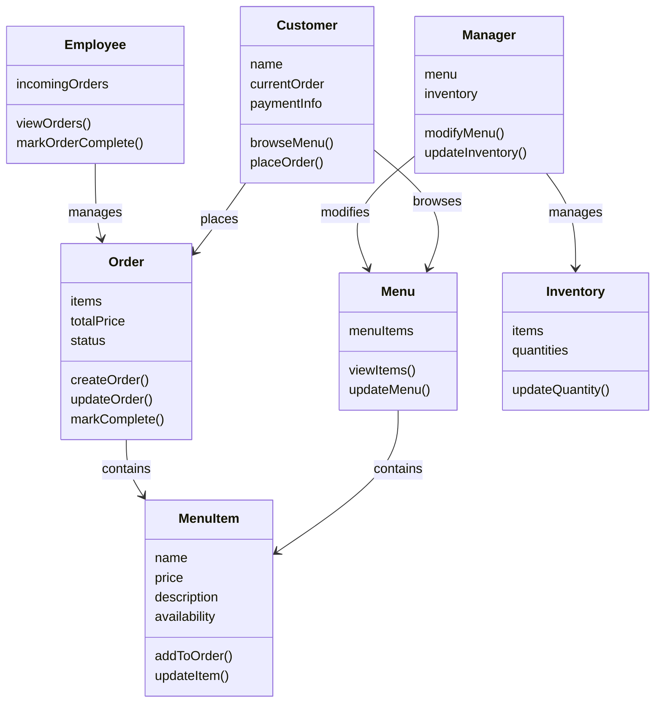

# Individual Sketch 1 by Kaashif Khan

## Entities

### Customer
Knows: The customer knows their name, current order, and payment information.
Does: The customer can browse the menu and place an order.

### Menu
Knows: Menu knows what items are available, the prices of the items, and descriptions.
Does: The menu allows customers to view items as well as allowing managers to update them.

### Employee
Knows: Employee knows incoming orders and status of the orders 
Does: Employee can view orders + mark orders as complete 

### Manager
Knows: Knows current inventory and menu 
Does: The manager can change/update menu items and update inventory

### MenuItem
Knows: name, price, description, and availability.
Does: Can be added to an order or updated by manager.

### Order
Knows: An order knows which menu items were ordered, the total price, and its current status.
Does: An order can be created, updated, and marked as complete.

### Inventory
Knows:Ingredients and/or products are available and their quantity
Does: Update quantities when items are added, removed, or used.

## Mermaid

